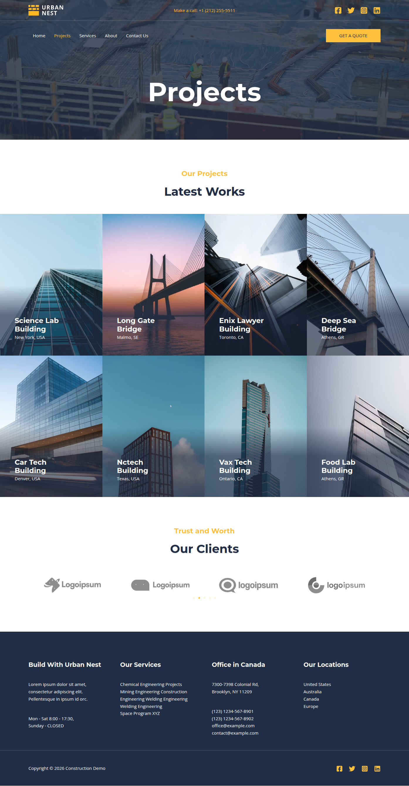
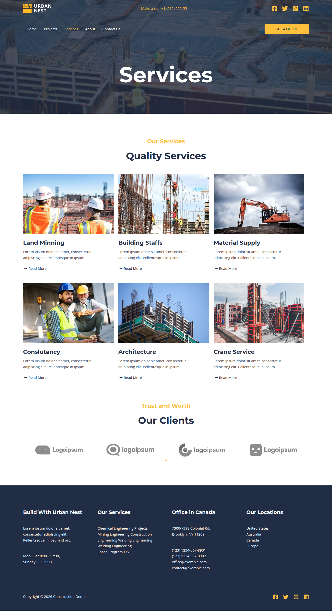
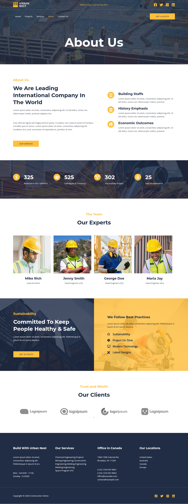
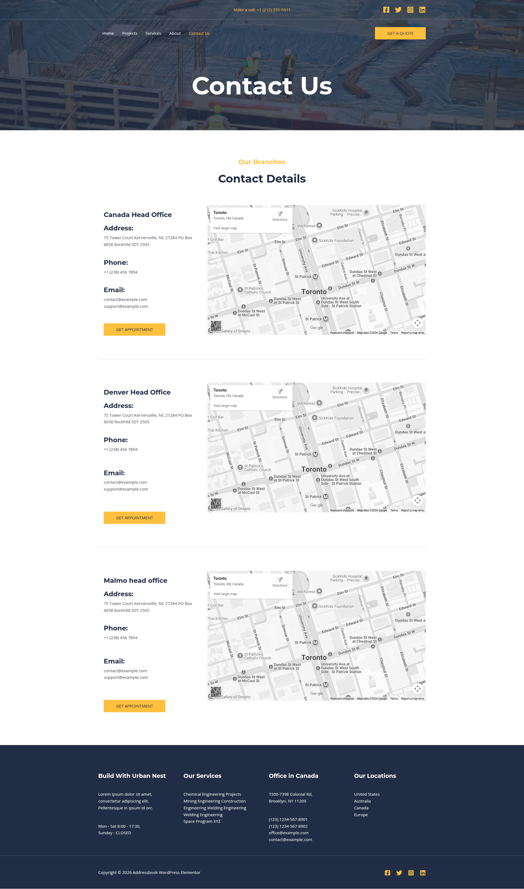

# Addressbook-WordPress-Elementor

### WordPress + Elementor Demo Project

## 📌 Overview

This repository contains **Address Book** application for WordPress with Elementor that shows design & coding practices followed by **[Differenz System](http://www.differenzsystem.com/)**.

This project is a fully functional **Elementor Website**
built using **WordPress** and **Elementor Page Builder**.

It demonstrates how to create a modern, responsive, and professional
business website suitable for construction companies, contractors,
builders, and infrastructure firms.

The repository includes complete WordPress files along with a database
(`.sql`) file for easy local setup.

------------------------------------------------------------------------

## 🚀 Features

-   Modern Design Layout
-   Built with Elementor Page Builder
-   Fully Responsive Design
-   Services Section
-   Projects / Portfolio Showcase
-   About Us Page
-   Contact Page
-   WordPress Admin Dashboard
-   Database File Included for Quick Setup

------------------------------------------------------------------------

## 🛠 Tech Stack

-   WordPress
-   Elementor
-   PHP
-   MySQL
-   HTML5
-   CSS3
-   JavaScript

------------------------------------------------------------------------

## 📂 Project Structure

    Addressbook-WordPress-Elementor/
    │
    ├── wp-admin/
    ├── wp-content/
    │   ├── themes/
    │   ├── plugins/
    │
    ├── wp-config.php
    ├── addressbook-wordpress-elementor.sql
    └── README.md

------------------------------------------------------------------------

## ⚙️ Local Installation Guide

### 1️⃣ Clone the Repository

``` bash
git clone https://github.com/differenz-system/Addressbook-WordPress-Elementor.git
```

------------------------------------------------------------------------

### 2️⃣ Move Project to Local Server

Place the folder inside:

-   XAMPP → `htdocs/`
-   WAMP → `www/`
-   MAMP → `htdocs/`

Example:

    htdocs/Addressbook-WordPress-Elementor

------------------------------------------------------------------------

### 3️⃣ Create Database

1.  Open **phpMyAdmin**
2.  Create a new database (example: `addressbook-wordpress-elementor`)
3.  Click **Import**
4.  Upload the provided `addressbook-wordpress-elementor.sql` file

------------------------------------------------------------------------

### 4️⃣ Update wp-config.php

Update the database configuration:

``` php
define('DB_NAME', 'addressbook-wordpress-elementor');
define('DB_USER', 'root');
define('DB_PASSWORD', 'DB_Password');
define('DB_HOST', 'localhost');
```

------------------------------------------------------------------------

### 5️⃣ Update Site URL (Important)

After importing the database:

Go to the `wp_options` table and update:

-   `siteurl`
-   `home`

Change them to:

    http://localhost/Addressbook-WordPress-Elementor

Or use WP CLI:

``` bash
wp search-replace 'old-domain.com' 'http://localhost/Addressbook-WordPress-Elementor'
```

------------------------------------------------------------------------

## 🔐 Admin Login (Demo)

    URL: http://localhost/Addressbook-WordPress-Elementor/wp-admin
    Username: admin@gmail.com
    Password: 123456

⚠️ It is recommended to change credentials after setup.

------------------------------------------------------------------------

## 💻 System Requirements

-   PHP 7.4+
-   MySQL 5.7+
-   WordPress 6.x
-   Local Development Environment (XAMPP / WAMP / MAMP)


------------------------------------------------------------------------
## 📸 Screenshots

### Home Page


### Projects Page


### Services Page


### About us Page


### Contact Page


------------------------------------------------------------------------
## 🎧 Support
If you've found an error in this sample, please [report an issue](https://github.com/differenz-system/Addressbook-WordPress-Elementor/issues/new). You can also send your feedback and suggestions at info@differenzsystem.com

Happy coding!
